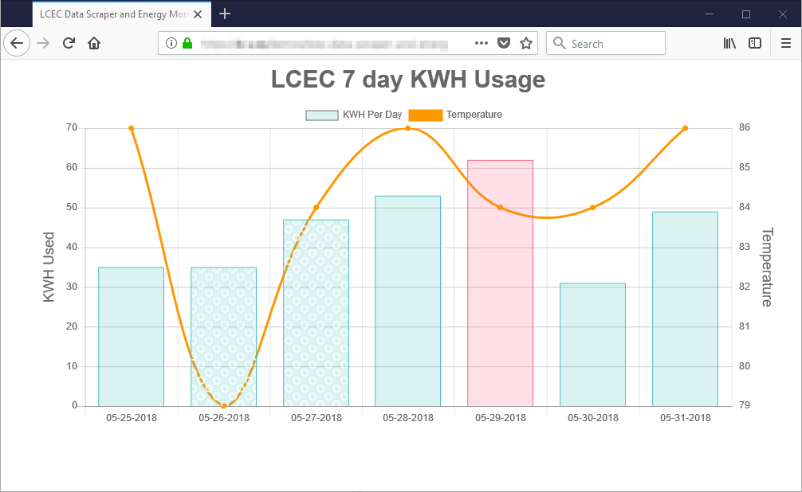

# LCEC (Lee County Electric Cooperative) Data Scraper and Energy Monitor Dashboard

Made for Lee County (Florida) residents with LCEC (Lee County Electric Cooperative) as their electric utility company.

Now you can long-term track your personal KWH usage with data copied to your personal database.

## Requirements:
* PHP >= 7.1.3
* OpenSSL PHP Extension
* PDO PHP Extension
* Mbstring PHP Extension
* Tokenizer PHP Extension
* XML PHP Extension
* Ctype PHP Extension
* JSON PHP Extension
* PHPRedis Extension
## Dev notes:
1. Working on:
   * Dashboard Design
   * Switch from CDN to local assets
   * Tweak standard deviation formula for outlier KWH usage
   * Add backend logging
   * Find alernate historical low/high/avg temperature API source
   * Alternate daily temperature source
   * Basic data analysis
   * Better README
   * Submit release 1.0
## Made with & thanks to:
- [Laravel Framework](https://github.com/laravel/laravel)
- [Goutte, a simple PHP Web Scraper](https://github.com/FriendsOfPHP/Goutte)
- [Bootstrap 4](https://getbootstrap.com/)
- [Chart.js](https://github.com/chartjs)
- [PHPStorm IDE](https://www.jetbrains.com/phpstorm/)
- [Sophie, my dog](https://www.dropbox.com/s/40g8apyqmz8tzb7/sophie.jpg?raw=1)
## Author:
Brennan Vargas ([me@b-v.co](mailto:me@b-v.co))
## License:
- [MIT](LICENSE)